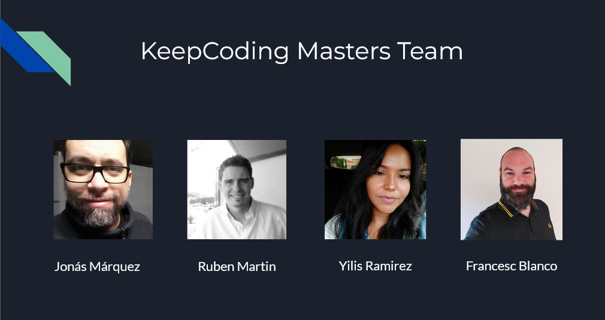

# keepcoding-masters-proyecto-final
KeepCoding DevOps V5 Final Project

## Our Team
```
# KeepCoding DevOps & Cloud Computing Full Stack Bootcamp (Final Project)
# Team: KeepCoding Masters
# Staff: Jonas Marquez, Ruben Martin, Yilis Ramirez, Francesc Blanco
# IaC (Infrastructure as Code) & GitOps with Terraform + Atlantis & K8s (Rancher RKE in AWS)
# Technologies: HashiCorp Terraform & Packer, AWS, Docker, K8s, Atlantis, ArgoCD, 
# Flask, MySQL, Prometheus, Grafana
# --------------------------------------------------------------------------
```


## Project presentation
Presentation used in our pitch can be found here: [presentation/KeepCoding DevOps Final Project - KeepCoding Masters.pdf](presentation/KeepCoding%20DevOps%20Final%20Project%20-%20KeepCoding%20Masters.pdf)

[Back to the top](#keepcoding-masters-proyecto-final)

## Project distribution

1.- [CORE Infrastructure Deployment](https://github.com/jonasmarquez/keepcoding-masters-proyecto-final/tree/main/infrastructure/core): contains the necessary manifests for the deployment of the main infrastructure and the `Kubernetes` cluster.

2.- [Rancher Cluster Deployment](https://github.com/jonasmarquez/keepcoding-masters-proyecto-final/tree/main/infrastructure/atlantis-rancher-cluster) from `Atlantis`

3.- [GitOps Solution Deployment](https://github.com/jonasmarquez/keepcoding-masters-proyecto-final/tree/main/cicd) (ArgoCD): contains the yaml files to deploy the `ArgoCD` Application and the Makefile to run the Image `Docker` build from `Github Actions`.

4.- [Application Deployment](https://github.com/jonasmarquez/keepcoding-masters-proyecto-final/tree/main/k8s): directory containing the used `Helm` charts.

5.- [Monitoring and Alerting Deployment](https://github.com/jonasmarquez/keepcoding-masters-proyecto-final/tree/main/monitoring): directoy containing all `Prometheus` and `Grafana` monitoring and alert dashboards, and necessary manifests for configuration.

[Back to the top](#keepcoding-masters-proyecto-final)

## Other repos:
- Real repository used to deploy all manifests for our Final Project KeepCoding DevOps V5:
https://github.com/jonasmarquez/keepcoding-masters-proyecto-final

- Infrastructure repository to deploy `k8s` cluster with `Terraform` and `Atlantis`: 
https://github.com/jonasmarquezkc/atlantis-rancher-cluster

[Back to the top](#keepcoding-masters-proyecto-final)
