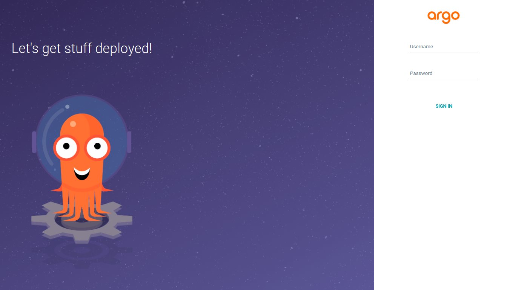
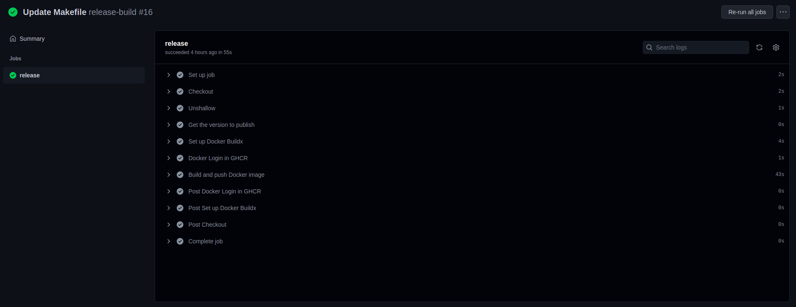
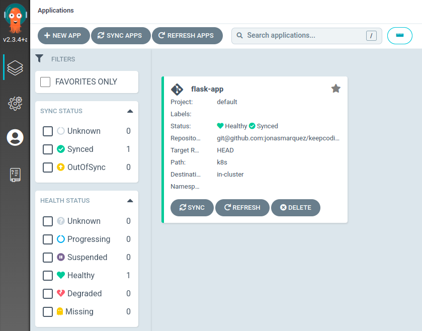
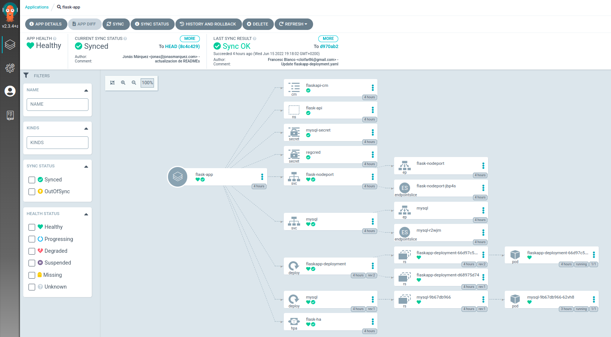

# keepcoding-masters-proyecto-final
KeepCoding DevOps V5 Final Project

# CI/CD

## Table of Contents

1. [GitOps](#1-gitops)
2. [ArgoCD Installation](#2-argocd-installation)
3. [Workflow](#3-workflow)
4. [Application Deployment](#4-application-deployment)
5. [YAML Configurations](#5-yaml-configurations)

## 1. GitOps
In this project, we want a fully automated deployment. That's why we chose a CI/CD strategy called `GitOps`.

To achieve that, we opted to use 2 different technologies:
-	GitHub Actions for CI: Builds Docker Image and push it to the Registry
- 	ArgoCD for CD: A declarative CD that deploys the Application automatically with K8s manifests 

[Back to the top](#ci/cd)

## 2. ArgoCD Installation
First of all we need to Install ArgoCD in our Kubernetes Cluster. The best and easiest way to install ArgoCD is as follows:

>NOTE: We need to have the `kubectl` command-line tool

```
kubectl create namespace argocd
kubectl apply -n argocd -f https://raw.githubusercontent.com/argoproj/argo-cd/stable/manifests/install.yaml
```

Now, we need to access the ArgoCD UI, there are three ways to expose the ArgoCD API server:

### Service Type Load Balancer
Change the argocd-server service type to LoadBalancer:
```
kubectl patch svc argocd-server -n argocd -p '{"spec": {"type": "LoadBalancer"}}'
```  

### Port Forwarding
Kubectl port-forwarding can also be used to connect to the API server without exposing the service.

```
kubectl port-forward svc/argocd-server -n argocd 8080:443
```

The API server can then be accessed using the localhost:8080

### Ingress
Setting an Ingress to the argocd-server service.

### Credentials
To log in the first time, we must use the `admin` user.  
The password is in the `argocd-initial-admin-secret` secret.

  

[Back to the top](#ci/cd)

## 3. Workflow
The first steps of the worflow occur in GitHub Actions.

We set a Workflow as follows:
- Triggers when a new Tag is pushed.
- The new Tag must begins with a "v" (e.g. v0.0.3)
- It builds a Docker image, with the help of `Make`, with the same tag except for the initial "v".
- Pushes this Image to the GitHub Container Registry we are using for this project (ghcr.io/fblancot86).

  


[Back to the top](#ci/cd)

## 4. Application Deployment
In ArgoCD we must have an Application configured, in order to start to synchronize it with the manifests in the Repository.

Whe need to apply theese manifests:
```
kubectl apply -f cicd/argocd/.
```

This will initiate the ArgoCD Application and will set the SSH credentials secret to access our private Repository. Every 3 minutes will poll the SCM to changes and will synchronize the entire application if needed. Once a manifest is updated (e.g. the tag of the image in a deployment) it will last 3 minuts at most to synchronize it in the Cluster.


Once done, it must appear a new application tile in the ArgoCD UI.



Inside the application, we can see all the resources deployed for that Application, along with their status.



[Back to the top](#ci/cd)

## 5. YAML Configurations

There are 3 main Yaml files:

- [ArgoCD flask-app application.yaml](https://github.com/jonasmarquez/keepcoding-masters-proyecto-final/tree/main/cicd/argocd/application.yaml): An application kind manifest that creates tbe flask-app Application in ArgoCD.

- [GitHub Repository Credentials](https://github.com/jonasmarquez/keepcoding-masters-proyecto-final/tree/main/cicd/argocd/credentials.yaml): A Secret that stores the private SSH key to poll the Repository where the k8s manifests are stored.


- [GitHub Actions Workflow](https://github.com/jonasmarquez/keepcoding-masters-proyecto-final/tree/main/.github/workflows/release.yaml): The yaml file that configures the workflow used to build and push the new Docker Image to the Registry automatically.

[Back to the top](#ci/cd)
