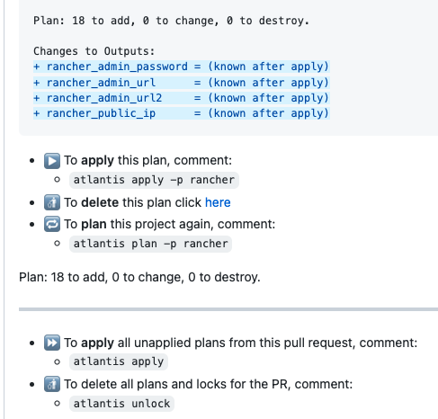
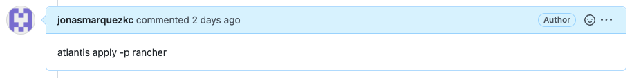
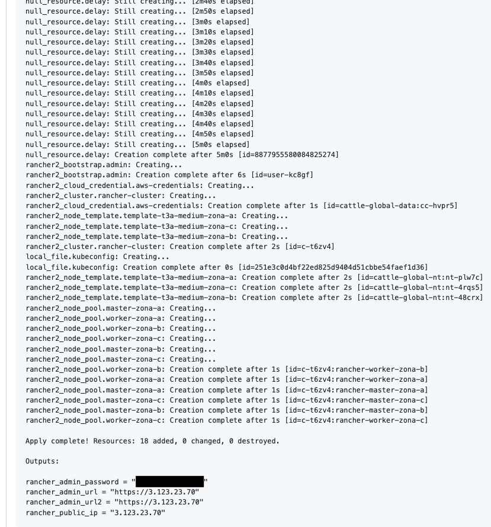
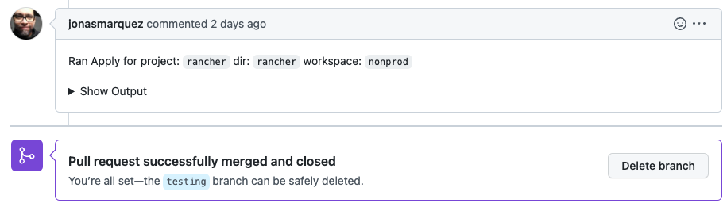

# Atlantis Cluster Rancher Deployment

This Atlantis project contains the rancher directory which contains the Terraform manifests needed to deploy a Rancher RKE 2.6 (Kubernetes) cluster using HashiCorp Vault as a sensible data store, bootstrapping the Rancher admin password and deploying a cluster with a pool of masters (etcd + controlplane) and a pool of workers, each pool with one node in each availability zone.

The content of this directory must be in an isolated repository and with the Webhook configuration made pointing to the Atlantis instance.

### The Rancher deployment from this Atlantis project is applied with the following steps:

1. We push the changes to a branch other than master/main (example: testing)
2. We create a Pull Request from the testing branch to the master/main branch and add a reviewer or approver, Atlantis listens to the event through the Webhook and starts the Terraform Plan from the project manifests and it blocks the project
   
3. Atlantis returns as a comment the output of the Terraform Plan
   
   
4. The approver validates and approves the deployment
5. The requester adds the comment "atlantis apply -p <PROJECT NAME>"
   
6. Atlantis applies the terraform manifests
7. At the end, Atlantis returns the output of the deployed infrastructure as a comment in the PR.
   
8. Finally, the applicant does a MERGE of the PR.
   