# keepcoding-masters-proyecto-final
KeepCoding DevOps V5 Final Project

# Monitoring and Alerting

## Table of Contents

1. [Rancher Monitoring](#1-rancher-monitoring)
2. [Components](#2-components)
3. [Services we are monitoring](#3-services-we-are-monitoring)
4. [Links to Dashboards](#4-links-to-dashboards)
5. [Installing Rancher-Monitoring and Configuration](#5-installing-rancher-monitoring-and-configuration)
6. [Slack Webhook Receiver configuration](#6-slack-webhook-receiver-configuration)
7. [Custom metrics dashboard](#7-custom-metrics-dashboards)

## 1. Rancher monitoring
Our project aims to deploy all the stack, including all cluster **Master** and **Worker** nodes, and all `Kube` components like `Etcd`, `Proxy`, `Scheduler`, etc.

We have decided to use `Rancher` as cluster, so we are using the `rancher-monitoring` to deploy all the open-source monitoring and alerting solutions into our cluster.

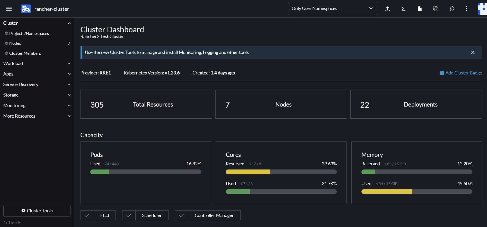

`Prometheus` lets you view metrics from Rancher and Kubernetes objects. Using timestamps, Prometheus lets you query and view these metrics in easy-to-read graphs and visuals, either through the `Rancher UI` or `Grafana`.

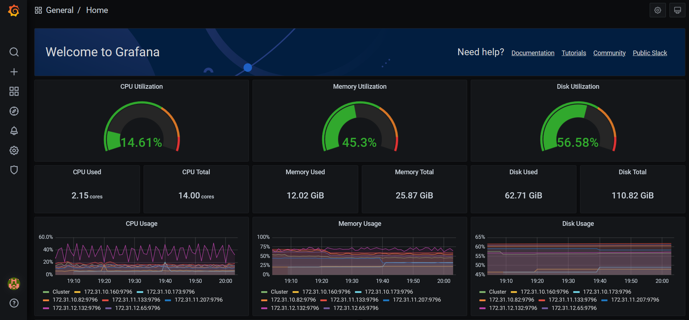

[Back to the top](#monitoring)

## 2. Components
Below are the `rancher-monitoring` operator components installed in the Cluster:
- [Prometheus](https://prometheus.io/): is an open-source systems monitoring and alerting toolkit originally built at [SoundCloud](https://soundcloud.com/).
- [Grafana](https://grafana.com/grafana/): allows you to query, visualize, alert on and understand your metrics no matter where they are stored.
- [Alertmanager](https://prometheus.io/docs/alerting/latest/alertmanager/): handles alerts sent by client applications such as the `Prometheus` server.
- [Prometheus Operator](https://github.com/prometheus-operator/prometheus-operator): provides `Kubernetes` native deployment and management of `Prometheus` and related monitoring components.
- [Prometheus adapter](https://github.com/kubernetes-sigs/prometheus-adapter): implementation of the `Kubernetes` resource metrics, custom metrics, and external metrics APIs.

[Back to the top](#monitoring)

## 3. Services we are monitoring
We want to cover all k8s cluster services, not only Worker's and our user Deployments.

Below are the services monitored:
- Kube
	- Controller-manager
	- Proxy
	- Scheduler
	- State-metrics
	- Node-exporter
- Altertmanager
- Grafana
- Operator
- Prometheus
- Api-server
- Coredns
- Kubelet

[Back to the top](#monitoring)

## 4. Links to Dashboards

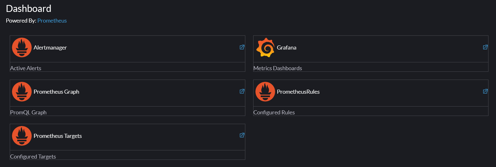

- Prometheus: [Link to Prometheus Dashboad](https://3.123.23.70/k8s/clusters/c-t6zv4/api/v1/namespaces/cattle-monitoring-system/services/http:rancher-monitoring-prometheus:9090/proxy/alerts)
	- By default, the [kube-state-metrics service](https://github.com/kubernetes/kube-state-metrics) provides a wealth of information about **CPU and memory** utilization to the monitoring application. 
	- These metrics **cover Kubernetes resources across namespaces**. 
	- This means that in order to see resource metrics for a service, you don’t need to create a new ServiceMonitor for it. 
	- Because the data is already in the time series database, you can go to the Prometheus UI and run a **PromQL query** to get the information. 
	- The **same query can be used to configure a Grafana dashboard** to show a graph of those metrics over time.

	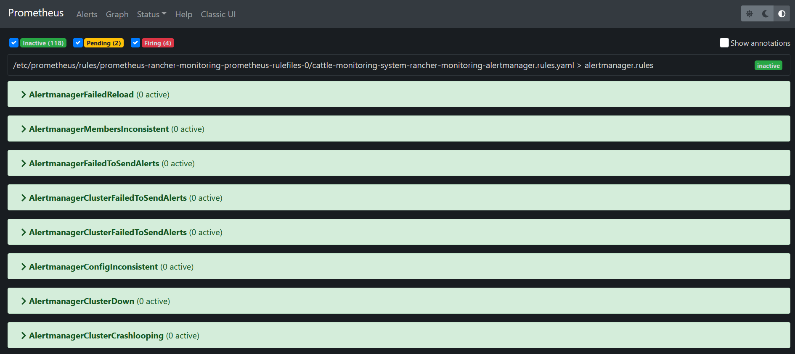

- Grafana: [Link to Grafana Dashboard](https://3.123.23.70/k8s/clusters/c-t6zv4/api/v1/namespaces/cattle-monitoring-system/services/http:rancher-monitoring-grafana:80/proxy/?orgId=1)
	- allows you to understand your metrics and create, explore, and share dashboards:
		- query
		- visualize
		- alert on
		- understand 
		- your metrics no matter where they are stored.  with your team and foster a data driven culture.
	
	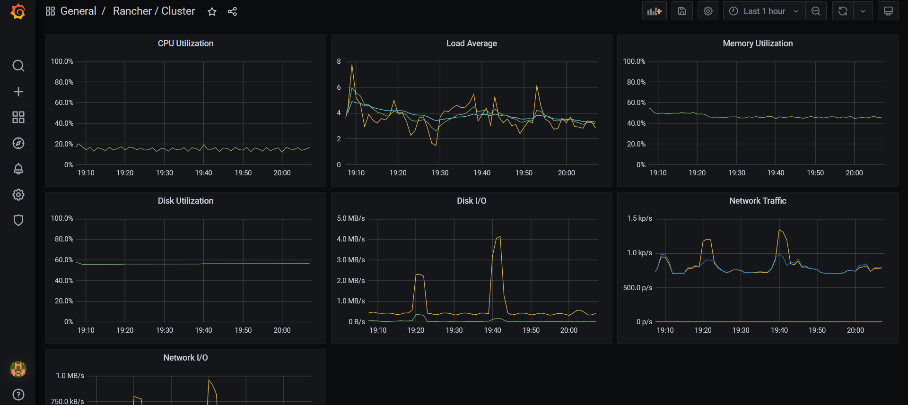

- Alertmanager: [Link to Alertmanager Dashboard](https://3.123.23.70/k8s/clusters/c-t6zv4/api/v1/namespaces/cattle-monitoring-system/services/http:rancher-monitoring-alertmanager:9093/proxy/#/alerts): handles alerts sent by client applications such as the `Prometheus` server.

	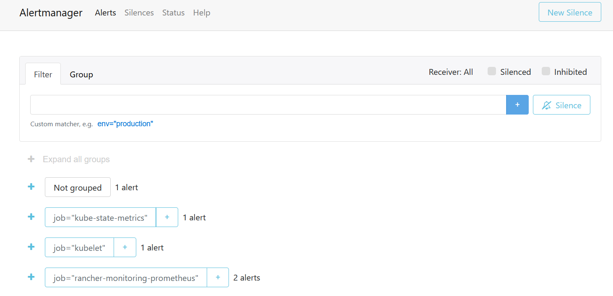

## 5. Installing Rancher-Monitoring and Configuration
We will install Chart [Rancher/rancher-monitoring.yaml](Rancher/rancher-monitoring.yaml). It can be done with `kubectl apply' or with Rancher UI.

Rancher monitoring installation:
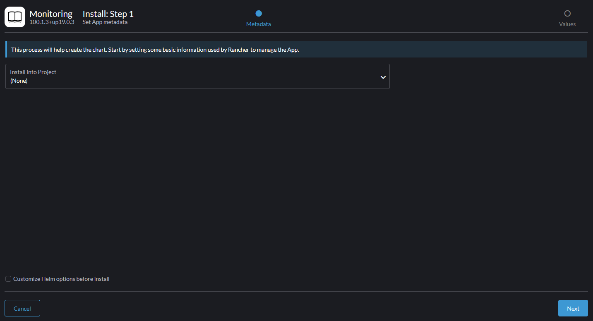

Chart info:
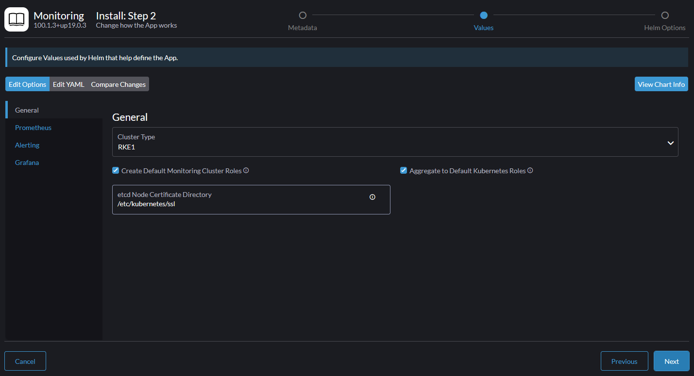

Cluster metrics:
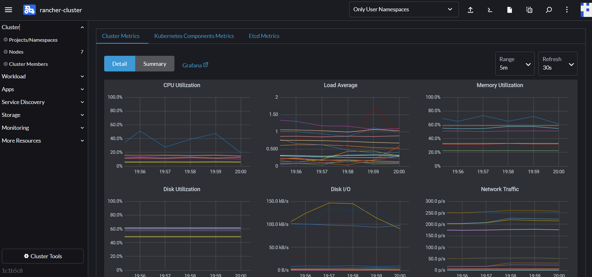

[Back to the top](#monitoring)

## 6. Slack Webhook Receiver configuration
In order to configure `Slack receiver` please follow next steps. It can be done with `kubectl apply` or with `Rancher` UI:

- We search for `alertmanager-rancher-monitoring-alertmanager`  secret in namespace `cattle-monitoring-system`:

	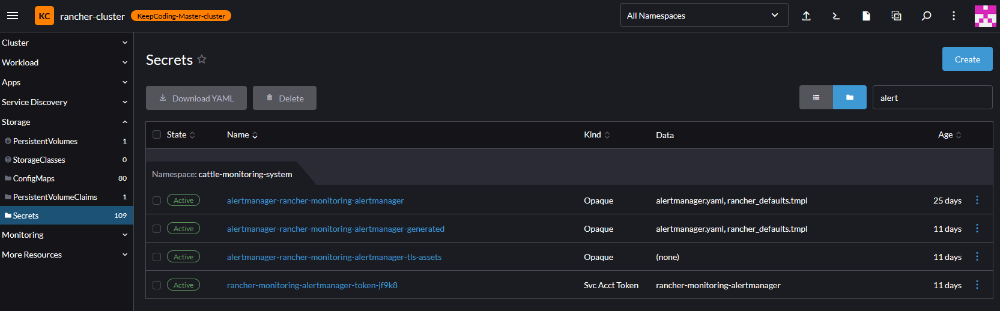

- Now we can change default yaml manifest to include ours with Webhook url and default `Slack` channel. Our custom configuration can be found here: [Rancher/alertmanager-rancher-monitoring-alertmanager.yaml](Rancher/alertmanager-rancher-monitoring-alertmanager.yaml)

	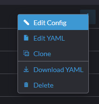

- Now we check if alerts are comming to our `Slack`:

	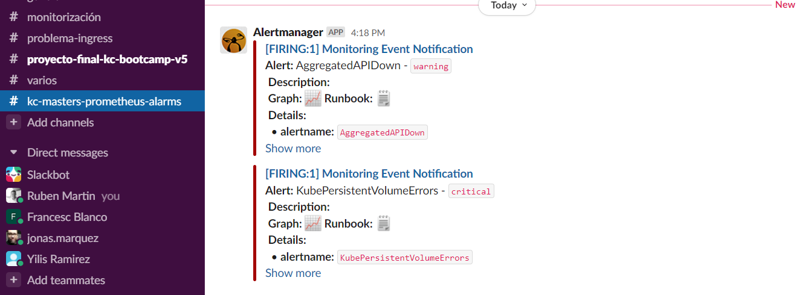

[Back to the top](#monitoring)

## 7. Custom metrics dashboard
Metrics Grafana custom dashboard and for our example app can be found here: [fast_api_custom_dashboard.json](fast_api_custom_dashboard.json).

[Back to the top](#monitoring)
